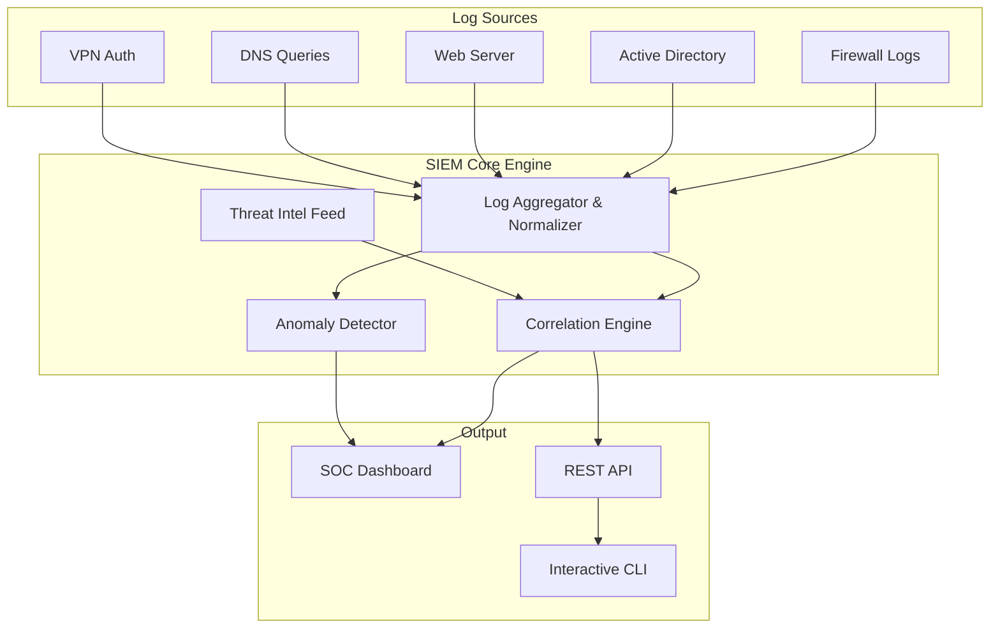

# Project 3: Enterprise SIEM & SOC Dashboard

## Overview

A comprehensive Security Information & Event Management (SIEM) system that collects, normalizes, correlates, and visualizes security events from multiple enterprise log sources in real-time—providing a centralized Security Operations Center (SOC) dashboard for incident detection and response.

## Architecture



## Features

### Log Collection & Normalization
- **Multi-source ingestion**: Firewall, Active Directory, Web Server, DNS, VPN, Syslog
- **CEF normalization**: All logs transformed into Common Event Format
- **RFC 5424 syslog parsing** with facility/severity extraction
- **Regex-based parsers** optimized for high-throughput processing

### Correlation Engine
- **Threshold-based detection**: Brute force, port scan, VPN attacks
- **Cross-source correlation**: Multi-vector attack detection across log sources
- **MITRE ATT&CK mapping**: Automatic technique/tactic classification
- **Deduplication**: Intelligent alert spam prevention

### Threat Intelligence
- **IP reputation scoring**: 0-100 risk scoring against simulated feeds
- **GeoIP enrichment**: Country/region/ISP mapping
- **Threat actor attribution**: APT group identification
- **IOC matching**: Indicators of Compromise database

### Anomaly Detection (Statistical)
- **Z-score baseline deviation**: Automatic baseline learning
- **Per-metric monitoring**: Events/min, logins/min, deny rate, unique IPs
- **Sliding window analysis**: Configurable observation windows

### SOC Dashboard
- **Overview**: Real-time stats, incident feed, live log stream
- **Alerts**: Detailed alert cards with MITRE mapping
- **Log Explorer**: Full-text search across historical logs
- **MITRE ATT&CK**: Detection coverage visualization

## Module Structure

```
Project-3-SIEM-Dashboard/
├── siem/
│   ├── __init__.py                # Package initialization
│   ├── log_aggregator.py          # Multi-source log collection & CEF normalization
│   ├── correlation_engine.py      # Multi-layer correlation with MITRE mapping
│   ├── threat_intel.py            # IP reputation, GeoIP, IOC matching
│   └── anomaly_detector.py        # Z-score statistical anomaly detection
├── dashboard/
│   ├── index.html                 # Multi-tab SOC dashboard
│   ├── style.css                  # Premium dark theme design system
│   └── app.js                     # Real-time polling, filtering, search
├── main.py                        # CLI + Web orchestrator (400+ lines)
└── requirements.txt
```

## Installation & Usage

```bash
pip install flask flask-cors

# Interactive mode (terminal)
python main.py

# Web dashboard
python main.py --web

# Log simulator only
python main.py --simulate
```

## Key Technologies
- **Python 3.10+** with type hints
- **Flask** REST API framework
- **Regex-based log parsing** (compiled patterns)
- **Statistical analysis** (Z-score, sliding window)
- **MITRE ATT&CK** framework integration
