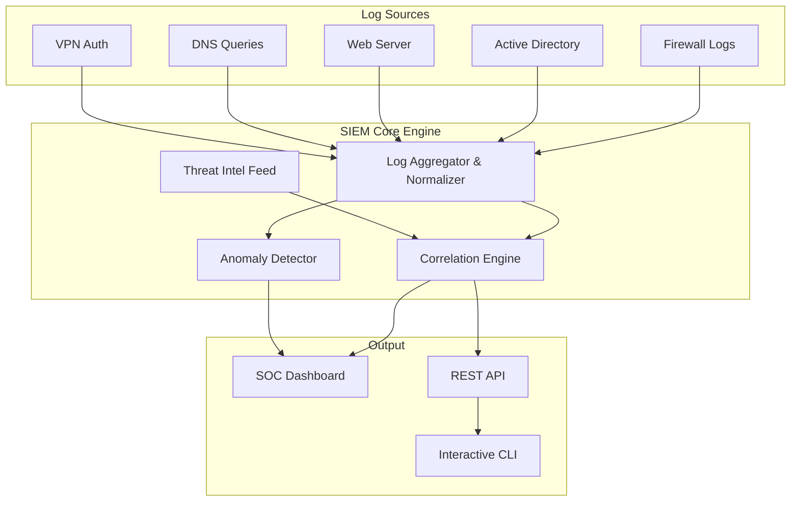

# Project 3: Enterprise SIEM & SOC Dashboard

## Overview

A comprehensive Security Information & Event Management (SIEM) system that collects, normalizes, correlates, and visualizes security events from multiple enterprise log sources in real-time—providing a centralized Security Operations Center (SOC) dashboard for incident detection and response.

## Architecture



## Features

### Log Collection & Normalization
- **Multi-source ingestion**: Firewall, Active Directory, Web Server, DNS, VPN, Syslog
- **CEF normalization**: All logs transformed into Common Event Format
- **RFC 5424 syslog parsing** with facility/severity extraction
- **Regex-based parsers** optimized for high-throughput processing
- **Async processing**: Non-blocking log ingestion and processing pipeline

### Correlation Engine
- **Threshold-based detection**: Brute force, port scan, VPN attacks
- **Cross-source correlation**: Multi-vector attack detection across log sources
- **MITRE ATT&CK mapping**: Automatic technique/tactic classification
- **Deduplication**: Intelligent alert spam prevention
- **Enrichment**: Threat intelligence and GeoIP data integration

### Threat Intelligence
- **IP reputation scoring**: 0-100 risk scoring against simulated feeds
- **GeoIP enrichment**: Country/region/ISP mapping
- **Threat actor attribution**: APT group identification
- **IOC matching**: Indicators of Compromise database
- **Cached lookups**: Performance optimization for repeated IP queries

### Anomaly Detection
- **Statistical Anomaly Detection**: Z-score baseline deviation with automatic baseline learning
- **Machine Learning Anomaly Detection**: Isolation Forest and One-Class SVM models for unsupervised learning
- **Per-metric monitoring**: Events/min, logins/min, deny rate, unique IPs, and custom metrics
- **Sliding window analysis**: Configurable observation windows for both statistical and ML detection
- **Model persistence**: Save/load trained models for consistent detection across restarts

### SOC Dashboard
- **Overview**: Real-time stats, incident feed, live log stream
- **Alerts**: Detailed alert cards with MITRE mapping and threat intelligence
- **Log Explorer**: Full-text search across historical logs
- **MITRE ATT&CK**: Detection coverage visualization
- **API Documentation**: Interactive Swagger/OpenAPI documentation for all REST endpoints

## Module Structure

```
Project-3-SIEM-Dashboard/
├── siem/
│   ├── __init__.py                # Package initialization
│   ├── log_aggregator.py          # Multi-source log collection & CEF normalization
│   ├── correlation_engine.py      # Multi-layer correlation with MITRE mapping
│   ├── threat_intel.py            # IP reputation, GeoIP, IOC matching
│   ├── anomaly_detector.py        # Z-score statistical anomaly detection
│   └── ml_anomaly_detector.py     # ML-based anomaly detection (Isolation Forest, One-Class SVM)
├── dashboard/
│   ├── index.html                 # Multi-tab SOC dashboard
│   ├── style.css                  # Premium dark theme design system
│   └── app.js                     # Real-time polling, filtering, search
├── main.py                        # CLI + Web orchestrator with async support & API docs (400+ lines)
├── tests/
│   ├── test_application_state.py  # Tests for ApplicationState class
│   ├── test_ml_detector.py        # Tests for ML anomaly detector
│   ├── test_collectors.py         # Tests for log collectors
│   ├── test_engine.py             # Tests for correlation engine
│   └── test_rules.py              # Tests for detection rules
├── models/                        # Trained ML models and metadata
│   ├── siem_ml_*.pkl              # Serialized ML models and scalers
│   ├── siem_ml_metadata.json      # Model metadata and performance metrics
│   └── test_save_load_*.pkl       # Test models for save/load functionality
└── requirements.txt
```

## Installation & Usage

```bash
pip install -r requirements.txt

# Interactive mode (terminal)
python main.py

# Web dashboard
python main.py --web

# Log simulator only
python main.py --simulate

# Run with development server (auto-reload)
python main.py --web --debug
```

## Key Technologies
- **Python 3.10+** with type hints
- **Flask** REST API framework
- **Regex-based log parsing** (compiled patterns)
- **Statistical analysis** (Z-score, sliding window)
- **MITRE ATT&CK** framework integration
