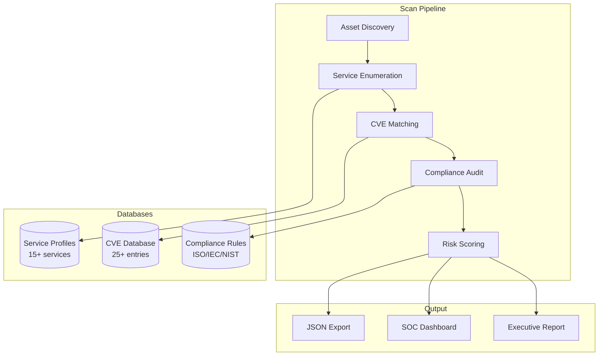

# Project 4: Enterprise Vulnerability & Compliance Scanner

## Overview

A comprehensive vulnerability assessment and multi-framework compliance auditing platform that scans enterprise network assets for known CVEs, performs service enumeration with banner grabbing, and evaluates configurations against ISO 27001, IEC 62443, and NIST CSF security standards.

## Architecture



## Features

### Service Enumeration
- **15+ service fingerprints**: SSH, HTTP, FTP, SMTP, DNS, SNMP, RDP, Modbus, MySQL, PostgreSQL, SMB
- **Banner grabbing simulation** with realistic banners and version extraction
- **Default credential database** per service type

### CVE Engine
- **25+ realistic CVE entries**: OpenSSH, Apache, nginx, Windows Server, OpenSSL, Log4j, MySQL, Samba
- **CVSS v3.1 scoring** with full vector string support
- **Exploit availability tracking** and public PoC references
- **Version range matching** for accurate vulnerability mapping

### Compliance Auditing
- **ISO 27001 Annex A**: Cryptography (A.10), Access Control (A.9), Network Security (A.13), Operations (A.12)
- **IEC 62443**: Industrial security zones, access control, encryption requirements
- **NIST CSF**: Identify, Protect, Detect, Respond, Recover categories
- **Composite grading**: A-F scale based on multi-framework evaluation

### Risk Assessment
- Composite risk scoring (0-100) combining CVSS, exploit availability, and compliance status
- Executive risk posture classification (Critical / High / Moderate / Secure)

## Module Structure

```
Project-4-Vulnerability-Scanner/
├── scanner/
│   ├── __init__.py
│   ├── service_enum.py           # Banner grabbing & service fingerprinting
│   ├── cve_engine.py             # CVE database with CVSS v3.1 scoring
│   └── config_tester.py          # Enterprise scan orchestrator
├── compliance/
│   ├── __init__.py
│   ├── iso27001_checks.py        # ISO 27001 Annex A audit checks
│   └── compliance_auditor.py     # Multi-framework evaluator
├── dashboard/
│   ├── index.html                # Executive risk dashboard
│   ├── style.css                 # Premium dark theme
│   └── app.js                    # Interactive filtering & visualization
├── main.py                       # CLI + Web orchestrator
└── requirements.txt
```

## Installation & Usage

```bash
pip install flask flask-cors

# Interactive mode
python main.py

# Web dashboard
python main.py --web

# CLI scan with JSON export
python main.py --scan --output report.json
```

## Key Technologies
- **Python 3.10+** with type hints
- **CVSS v3.1** vulnerability scoring
- **ISO 27001 / IEC 62443 / NIST CSF** compliance frameworks
- **Flask** REST API with executive dashboard
