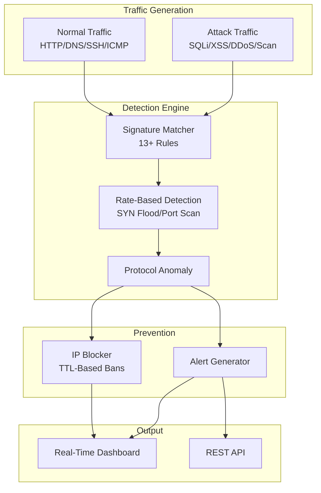

# Project 5: Intrusion Detection & Prevention System (IDS/IPS)

## Overview

A multi-layer intrusion detection and prevention system that combines signature-based pattern matching with rate-based anomaly detection to identify and block network threats in real-time. Features 13+ Snort-style detection rules, SYN flood/port scan detection, IP blocking with TTL management, and MITRE ATT&CK technique mapping.

## Architecture



## Features

### Traffic Generation (10 Attack Types)
- **SQL Injection** — OR bypass, UNION SELECT
- **XSS** — Script injection, event handlers
- **LFI** — Path traversal, /etc/passwd access
- **Port Scanning** — SYN-based reconnaissance
- **SYN Flood** — Spoofed source DDoS
- **DNS Tunneling** — Long domain exfiltration
- **SSH Brute Force** — Password authentication attacks
- **C2 Beaconing** — Malicious domain communication
- **ICMP Flood** — Ping of death / flooding
- **ARP Spoofing** — Man-in-the-middle attempts

### Detection Engine
- **13+ Snort-style signatures** with regex pattern matching
- **Rate-based detection**: SYN flood, port scan, brute force thresholds
- **Pre-compiled regex** for high-throughput analysis
- **MITRE ATT&CK mapping** for each detection rule

### Prevention (IPS)
- **IP blocking** with configurable TTL
- **Ban escalation** based on severity
- **Automatic expiration** of temporary blocks

## Module Structure

```
Project-5-IDS-IPS/
├── engine/
│   ├── __init__.py
│   ├── packet_sniffer.py         # Multi-protocol packet generation
│   └── signature_matcher.py      # Multi-layer detection engine
├── dashboard/
│   ├── index.html                # Real-time IDS/IPS dashboard
│   ├── style.css                 # Premium dark theme
│   └── app.js                    # Live packet stream & alerts
├── main.py                       # CLI + Web orchestrator
└── requirements.txt
```

## Installation & Usage

```bash
pip install flask flask-cors

# Interactive mode
python main.py

# Web dashboard
python main.py --web

# Custom attack ratio
python main.py --web --attack-ratio 0.3
```
