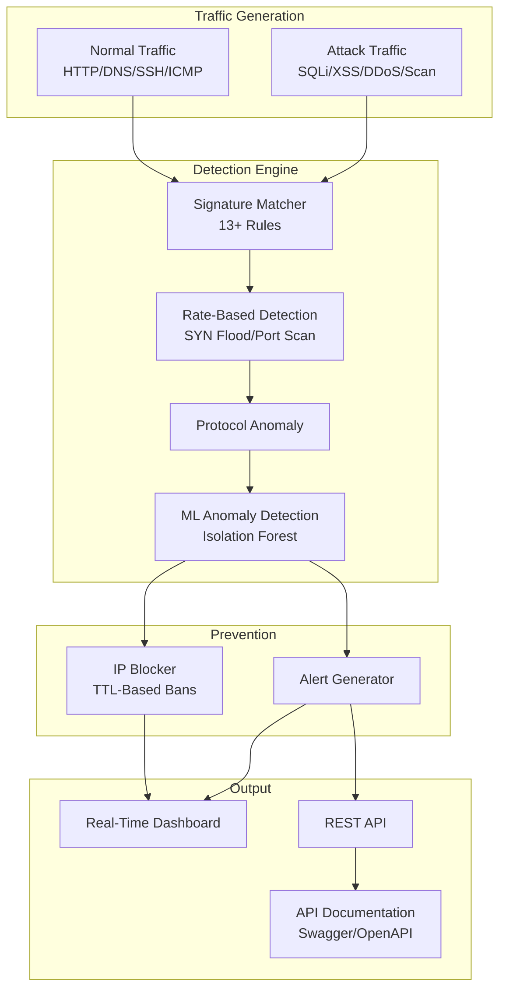

# Project 5: Intrusion Detection & Prevention System (IDS/IPS)

## Overview

A multi-layer intrusion detection and prevention system that combines signature-based pattern matching with rate-based anomaly detection to identify and block network threats in real-time. Features 13+ Snort-style detection rules, SYN flood/port scan detection, IP blocking with TTL management, and MITRE ATT&CK technique mapping.

## Architecture



## Features

### Traffic Generation (10 Attack Types)
- **SQL Injection** — OR bypass, UNION SELECT
- **XSS** — Script injection, event handlers
- **LFI** — Path traversal, /etc/passwd access
- **Port Scanning** — SYN-based reconnaissance
- **SYN Flood** — Spoofed source DDoS
- **DNS Tunneling** — Long domain exfiltration
- **SSH Brute Force** — Password authentication attacks
- **C2 Beaconing** — Malicious domain communication
- **ICMP Flood** — Ping of death / flooding
- **ARP Spoofing** — Man-in-the-middle attempts
- **Async Processing** - Non-blocking packet generation and analysis

### Detection Engine
- **13+ Snort-style signatures** with regex pattern matching
- **Rate-based detection**: SYN flood, port scan, brute force thresholds
- **Pre-compiled regex** for high-throughput analysis
- **MITRE ATT&CK mapping** for each detection rule
- **Enrichment**: Threat intelligence and GeoIP data integration
- **Machine Learning Anomaly Detection**: Isolation Forest for unsupervised anomaly detection
- **Statistical Anomaly Detection**: Z-score baseline deviation with sliding windows

### Prevention (IPS)
- **IP blocking** with configurable TTL
- **Ban escalation** based on severity
- **Automatic expiration** of temporary blocks
- **GeoIP-based blocking**: Automatic blocking of known malicious regions
- **Reputation-based blocking**: Integration with threat intelligence feeds

### SOC Dashboard & API
- **Real-Time Dashboard**: Live packet stream, attack visualization, alert management
- **REST API**: Full programmatic access to all IDS/IPS functions
- **API Documentation**: Interactive Swagger/OpenAPI documentation for all endpoints
- **Attack Analytics**: Statistical analysis of attack patterns and trends
- **Blocked IP Management**: View and manage blocked IP addresses with TTL

## Module Structure

```
Project-5-IDS-IPS/
├── engine/
│   ├── __init__.py
│   ├── packet_sniffer.py         # Multi-protocol packet generation
│   ├── signature_matcher.py      # Multi-layer detection engine (signature + rate)
│   ├── ml_anomaly_detector.py    # ML-based anomaly detection (Isolation Forest)
│   ├── stats_anomaly_detector.py # Statistical anomaly detection (Z-score)
│   └── threat_intel.py           # Threat intelligence enrichment
├── dashboard/
│   ├── index.html                # Real-time IDS/IPS dashboard
│   ├── style.css                 # Premium dark theme
│   └── app.js                    # Live packet stream & alerts
├── main.py                       # CLI + Web orchestrator with async support & API docs
├── tests/
│   ├── test_engine.py            # Tests for detection engine
│   ├── test_ips.py               # Tests for IP blocker
│   ├── test_ml_detector.py       # Tests for ML anomaly detector
│   ├── test_stats_detector.py    # Tests for statistical anomaly detector
│   └── test_application_state.py # Tests for application state management
├── models/                       # ML models and metadata
│   ├── ids_ml_*.pkl              # Serialized ML models and scalers
│   └── ids_ml_metadata.json      # Model metadata and performance metrics
├── requirements.txt
└── SIEM_TODO.md                  # Future enhancement roadmap
```

## Installation & Usage

```bash
pip install -r requirements.txt

# Interactive mode
python main.py

# Web dashboard
python main.py --web

# Custom attack ratio
python main.py --web --attack-ratio 0.3

# Run with development server (auto-reload)
python main.py --web --debug

# Run traffic simulation only (CLI)
python main.py --simulate
```
