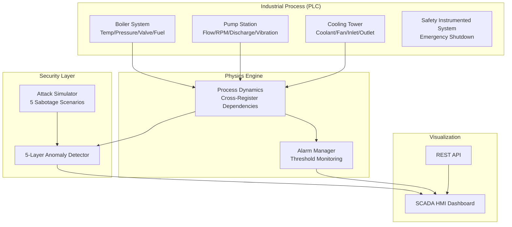

# Project 6: OT/ICS Security Monitor

## Overview

A comprehensive Operational Technology (OT) / Industrial Control System (ICS) security monitoring platform that simulates a refinery Crude Distillation Unit (CDU) with multiple PLC subsystems, performs 5-layer anomaly detection on Modbus traffic, and visualizes the industrial process through a SCADA-style HMI dashboard.

## Architecture



## Features

### PLC Simulation
- **4 Process Units**: Boiler, Pump, Cooling Tower, SIS
- **15 Holding Registers** with read/write protection
- **Physics-based dynamics**: Temperature→Pressure (ideal gas), RPM→Flow rate
- **Safety Instrumented System** with auto-trip logic

### 5-Layer Anomaly Detection
1. **Unauthorized Source IP** — Whitelist-based access control
2. **Read-Only Protection** — Write attempts to sensor registers
3. **Value Range Validation** — Safe operating parameter enforcement
4. **Rate of Change** — Detects sudden process value jumps
5. **Write Frequency** — Excessive modification detection

### Attack Simulation
- Register Overwrite (dangerous RPM values)
- Boiler Temperature Sabotage (max fuel rate)
- SIS Override Attack (disable safety systems)
- Valve Manipulation (pressure buildup)
- Cooling Fan Disable (thermal runaway)

### SCADA Dashboard
- **Process gauges** with real-time value visualization
- **Unit status indicators** (Normal/Warning/Critical)
- **SIS emergency status** with visual alarms
- **Security alert feed** with severity classification
- **Event log** with Modbus command tracking

## Module Structure

```
Project-6-OT-ICS-Security/
├── simulation/
│   ├── __init__.py
│   └── plc_simulator.py         # PLC with physics & alarm management
├── monitor/
│   ├── __init__.py
│   └── anomaly_detector.py      # 5-layer Modbus traffic analyzer
├── dashboard/
│   ├── index.html               # SCADA HMI dashboard
│   ├── style.css                # Industrial dark theme
│   └── app.js                   # Real-time gauge & alert rendering
├── main.py                      # CLI + Web orchestrator
└── requirements.txt
```

## Installation & Usage

```bash
pip install flask flask-cors

# Interactive mode
python main.py

# SCADA dashboard
python main.py --web

# Simulation only
python main.py --simulate
```

## Key Technologies
- **Modbus TCP** protocol simulation
- **Physics-based** industrial process modeling
- **IEC 62443** security zone concepts
- **NIST 800-82** OT security guidelines
